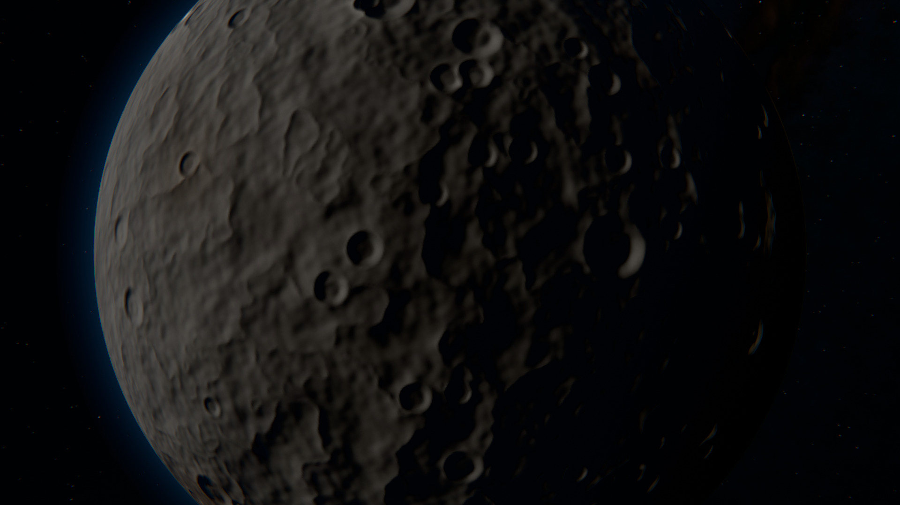

# ORBITAL

Native Windows and Linux C++20 space demo on a compatibility fork of [NoGraphicsAPI](https://github.com/sebbbi/NoGraphicsAPI): an Earth-like world, a gas giant with an asteroid belt, a rocky moon, a desert world with two small moons, and a minor planet whose surface is generated as you approach it.




|  |  |
| --- | --- |
|  |  |

## Details

Sourced material maps, atmospheric scattering, shadows, HDR with exposure adaptation and bloom, temporal plus SMAA anti-aliasing, three tone curves and a Dear ImGui control panel.

The asteroid belt is a deterministic rock population drawn as meshes near the camera and splats further out, with its own transmittance and extinction maps, forward-scattering dust and a lit disc. The sky is the Milky Way fitted as splats over a star catalogue.

The minor planet carries a second terrain tier. Close in it stops being a textured sphere and becomes a CDLOD cube sphere: one shared grid mesh instanced per patch, shape and colour read from per-patch tiles that a CPU worker pool generates and streams into texture arrays, levels meeting without cracks by vertex morphing. The image above is that tier. How it works and what is still wrong with it is in [docs/DYNAMIC_TERRAIN.md](docs/DYNAMIC_TERRAIN.md).

## Build

Windows requires x64, MSVC C++ tools, CMake 3.25+, Ninja and Vulkan headers/loader import library (normally Vulkan SDK). NoGraphicsAPI is vendored under `third_party/NoGraphicsAPI`.

```powershell
./tools/bootstrap.ps1
./tools/build.ps1 -Preset release
ctest --preset release
./build/release/orbital.exe
```

Bootstrap downloads pinned shader tools; it does not install a GPU driver or full Vulkan SDK. Material textures are tracked in git as PNG; `tools/import-assets.ps1` records and reproduces their derivation from the upstream sources. Machine-specific overrides (for example an existing Vulkan loader library) go in an ignored `CMakeUserPresets.json`; in an MSVC developer shell, `cmake --preset <your-preset>` then `cmake --build --preset release`.

Shaders are Slang, compiled offline, with a shared C++/shader layout header. See [docs/FOUNDATION.md](docs/FOUNDATION.md) for the compatibility backend.

For Linux setup, build presets, validation and SSH launch instructions, see [Linux](docs/LINUX.md).

## Explore

RMB + mouse looks around; holding the middle button is a 5x telescope; WASD flies, Q/E moves vertically, Shift accelerates and Z halves the travel speed for close work. Keys 1–9 select the bookmarked views: Earth, Jupiter, Moon, Mars, dawn, belt, the two dust views, and the minor planet. The tenth, the minor planet up close, is on the panel or `--bookmark 9`. T starts and stops the tour, O orbits the selected body, F returns to free flight. Space pauses the system; +/- changes exposure, X toggles adaptation.

Tab opens the control panel (`--ui` opens it at start), which holds frame statistics and every toggle below. The hotkeys: F1 HUD, F2 quality tier, F3 belt transmittance map, F4 belt extinction, F5 temporal anti-aliasing, F6 rock splat cut-off (off, 1.2, 2.5, 4 px), F7 splat lighting in both culling passes, F8 tone curve (PBR Neutral, AgX, ACES filmic), F9 spatial anti-aliasing (off, FXAA, SMAA), F10 capture (captures/orbital-0001.png and on, never overwriting), F11 belt dust, Alt+Enter borderless fullscreen, Esc exit.

```powershell
./build/release/orbital.exe --width 1920 --height 1080 --tour
./build/release/orbital.exe --bookmark 5 --time 0 --frames 300 --high --benchmark belt.csv
./build/release/orbital.exe --bookmark 4 --time 0 --frames 60 --no-hud --capture captures/dawn.png
./build/release/orbital.exe --bookmark 5 --time 0 --frames 40 --pan 3 --spatial 0 --capture captures/pan.png
./build/release/orbital.exe --bookmark 9 --time 1200 --back 0.05 --frames 120 --no-hud --high --width 1920 --height 1080 --capture captures/minor-planet.png
```

The last of those is the image at the top of this page, pixel for pixel.

`--help` lists every option. `--time` freezes the simulation and exposure adaptation for reproducible captures; `--benchmark` writes per-frame CPU and GPU pass timings and runs with vsync off (`--vsync 0|1` overrides, and the panel has a switch), because a vsynced GPU idles between frames and clocks down, which inflates its timestamps on a fast card; `--pan` strafes the camera at a fixed rate to compare anti-aliasing modes in motion; `--rocks N` overrides the belt size.

`--back units` moves along the bookmarked body's line and keeps aiming at it, negative coming in until it reaches the terrain, and `--fov-div` zooms like a telescope; together they frame a body without hand-flying to it. `--shots file` runs a list of `key=value` views in one process and `--report file.json` writes their readings, `--headless` hiding the window throughout.

The near tier has its own switches: `--near-tier 0|1` falls back to the textured sphere, `--wireframe 1` draws the patch grid, `--terrain-debug 0..5` isolates one shading term at a time, `--lod-bias X` scales every patch range by `2^X`, and `--terrain-detail X` sets the micro-relief in the tiles.

`python tools/check.py` is the quick render check: every view in one process, diffed against an accepted reference. For repeatable scene/window/fullscreen measurements and comparisons against saved milestones, use [the performance suite](docs/PERFORMANCE.md).

## Repository layout

| Path | Contents |
| --- | --- |
| `src/core` | Logging, panic, file I/O and vector/matrix math shared by everything else |
| `src/platform` | OS-neutral window, input, process, text-overlay and ImGui-overlay interfaces; `win32/` and `linux/` implement them |
| `src/app` | Options, camera, HUD, control panel and the frame loop; no OS calls |
| `src/scene` | Deterministic system generation, rock population, mesh geometry and the minor planet's terrain and patch quadtree |
| `src/assets` | PNG image I/O (Wuffs decode, stb write), SIMD pixel kernels and material mip-chain generation |
| `src/render` | The renderer on NoGraphicsAPI: resources and materials, per-frame passes, the terrain tier's selection and streaming, GPU-side types |
| `shaders/` | Slang shaders; `scene_shared.h` is the shared C++/shader layout |
| `tests/` | Executable-assertion tests run through CTest |
| `tools/` | PowerShell scripts (bootstrap, asset import, build, format, GCC check, smoke and stability checks) and Python tools (render and shader checks, benchmark suite, asset bakes, texture compression) |
| `cmake/` | Slang shader compilation helper |
| `docs/` | Architecture, decisions, foundation, assets, terrain and code style ([index](docs/README.md)) |
| `third_party/` | Vendored NoGraphicsAPI fork with its patch against upstream, Dear ImGui, SMAA tables, Wuffs and stb_image_write ([details](third_party/README.md)) |


## License

The demo is released under the [MIT License](LICENSE). NoGraphicsAPI is MIT licensed (`third_party/NoGraphicsAPI/LICENSE`); Dear ImGui is MIT (`third_party/imgui/LICENSE.txt`); the SMAA lookup tables and reference shader are MIT-style (`third_party/smaa/LICENSE.txt`); Wuffs is Apache-2.0 OR MIT (`third_party/wuffs/LICENSE`) and stb_image_write is public domain (`third_party/stb/LICENSE`). Material textures are CC BY 4.0 (Solar System Scope), public domain NASA (the Cassini Jupiter map, the Moon and Mars elevation and colour data), the public-domain Yale Bright Star Catalogue, ESO's Milky Way panorama (CC BY 4.0, ESO/S. Brunier, fitted as splats) and CC0 (Poly Haven); provenance, hashes and attribution requirements are in [docs/ASSETS.md](docs/ASSETS.md) and `assets/materials/manifest.json`. The minor planet's surface is generated at runtime from its seed and carries no sourced material. Keep attribution with redistributed assets.

Optional material compression: build `texture_tools`, then run `python tools/compress-textures.py`.
The demo prefers valid caches supported by the GPU and otherwise loads source PNGs.
See [texture compression](docs/TEXTURE_COMPRESSION.md) for setup and per-texture overrides.
