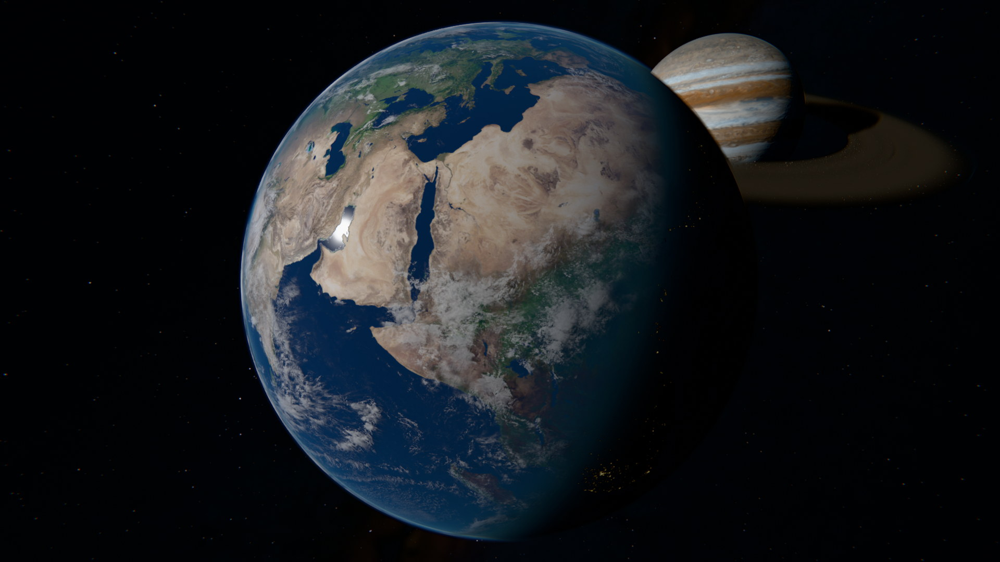
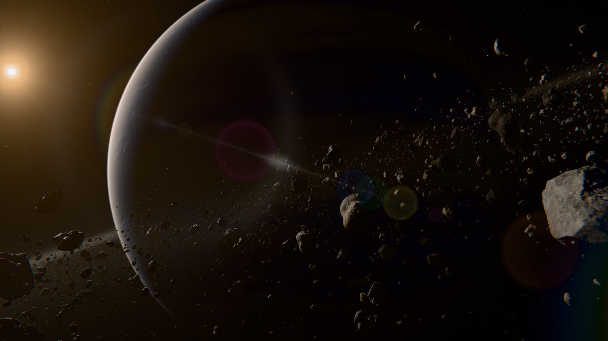
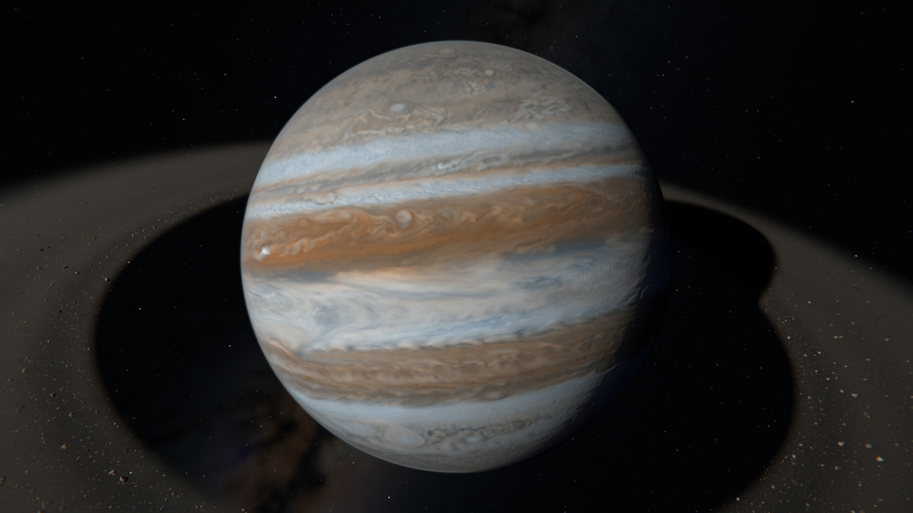
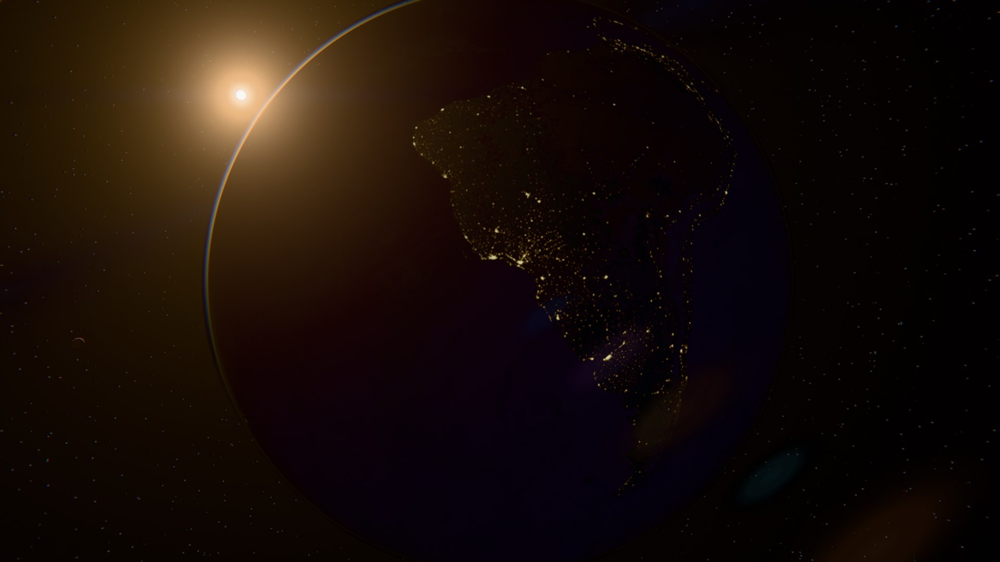
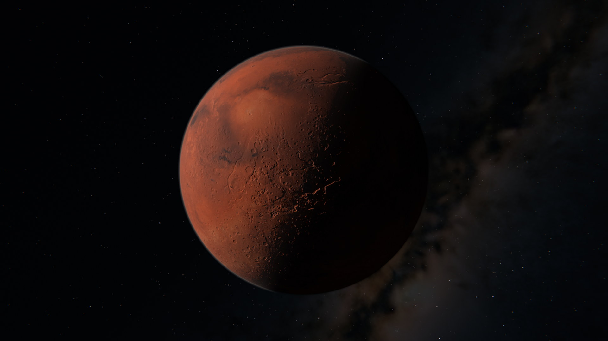

# ORBITAL

Native Windows C++20 space demo on a compatibility fork of [NoGraphicsAPI](https://github.com/sebbbi/NoGraphicsAPI): an Earth-like world, a gas giant with a half-million-rock asteroid belt, a rocky moon, a desert world with two moonlets. Sourced material maps, atmospheric scattering, shadows, HDR with exposure adaptation and bloom, temporal plus SMAA anti-aliasing, three tone curves and a Dear ImGui control panel.



|  |  |
| --- | --- |
|  |  |

## The belt

280,000 rocks in baseline and 520,000 in high quality, placed with rings, a gap, tapered edges, flared height, a power-law size distribution and three composition classes. Rocks come from a library of 16 seeded shapes at 6 detail levels (20 to 20k triangles), with three scanned rock sets blended per rock and triplanar mapping with parallax up close. A compute pass culls the whole population every frame (frustum, planet occlusion, projected size) and writes indirect draws for one pooled multi-draw; rocks under a few pixels become lit sphere-impostor splats. Rocks lose sunlight to the belt's own density, to a transmittance map splatted by the largest rocks and to the planets' shadows, and the fine matter between them is a scattering medium marched at half resolution. Once the camera leaves the belt, the rocks and dust blend into a baked disc: two maps over the belt plane, sunlight with the planets' shadows and the small rocks' coverage, marched through the slab's thickness so edge-on views keep their depth.

## Build

Requires Windows x64, MSVC C++ tools, CMake 3.24+, Ninja and Vulkan headers/loader import library (normally Vulkan SDK). NoGraphicsAPI is vendored under `third_party/NoGraphicsAPI`.

```powershell
./tools/bootstrap.ps1
./tools/build.ps1 -Preset release
ctest --preset release
./build/release/orbital.exe
```

Bootstrap downloads pinned shader tools; it does not install a GPU driver or full Vulkan SDK. Material textures are tracked in git as PNG; `tools/import-assets.ps1` records and reproduces their derivation from the upstream sources. Machine-specific overrides (for example an existing Vulkan loader library) go in an ignored `CMakeUserPresets.json`; in an MSVC developer shell, `cmake --preset <your-preset>` then `cmake --build --preset release`.

Shaders are Slang, compiled offline, with a shared C++/shader layout header. See [docs/FOUNDATION.md](docs/FOUNDATION.md) for the compatibility backend.

## Explore

RMB + mouse looks around; WASD flies, Q/E moves vertically, Shift accelerates. Keys 1–6 select the Earth, Jupiter, Moon, Mars, dawn and belt views. T starts and stops the tour, O orbits the selected body, F returns to free flight. Space pauses the system; +/- changes exposure, X toggles adaptation.

F12 opens the control panel (`--ui` opens it at start), which holds frame statistics and every toggle below. The hotkeys: F1 HUD, F2 quality tier, F3 belt transmittance map, F4 belt extinction, F5 temporal anti-aliasing, F6 rock splat cut-off (off, 1.2, 2.5, 4 px), F7 splat lighting in both culling passes, F8 tone curve (PBR Neutral, AgX, ACES filmic), F9 spatial anti-aliasing (off, FXAA, SMAA), F10 capture, F11 belt dust, Alt+Enter borderless fullscreen, Esc exit.

```powershell
./build/release/orbital.exe --width 1920 --height 1080 --tour
./build/release/orbital.exe --bookmark 5 --time 0 --frames 300 --high --benchmark belt.csv
./build/release/orbital.exe --bookmark 4 --time 0 --frames 60 --no-hud --capture captures/dawn.png
./build/release/orbital.exe --bookmark 5 --time 0 --frames 40 --pan 3 --spatial 0 --capture captures/pan.png
```

`--help` lists every option. `--time` freezes the simulation and exposure adaptation for reproducible captures; `--benchmark` writes per-frame CPU and GPU pass timings and runs with vsync off (`--vsync 0|1` overrides, and the panel has a switch), because a vsynced GPU idles between frames and clocks down, which inflates its timestamps on a fast card; `--pan` strafes the camera at a fixed rate to compare anti-aliasing modes in motion; `--rocks N` overrides the belt size.

## Repository layout

| Path | Contents |
| --- | --- |
| `src/core` | Logging, panic, file I/O and vector/matrix math shared by everything else |
| `src/platform` | OS-neutral window, input, process, text-overlay and ImGui-overlay interfaces; `win32/` implements them |
| `src/app` | Options, camera, HUD, control panel and the frame loop; no OS calls |
| `src/scene` | Deterministic system generation, rock population and mesh geometry |
| `src/assets` | PNG image I/O (Wuffs decode, stb write), SIMD pixel kernels and material mip-chain generation |
| `src/render` | The renderer on NoGraphicsAPI: resources and materials, per-frame passes, GPU-side types |
| `shaders/` | Slang shaders; `scene_shared.h` is the shared C++/shader layout |
| `tests/` | Executable-assertion tests run through CTest |
| `tools/` | PowerShell scripts: bootstrap, asset import, build, format, GCC check, smoke and stability checks |
| `cmake/` | Slang shader compilation helper |
| `docs/` | Architecture, decisions, foundation, assets and code style ([index](docs/README.md)) |
| `third_party/` | Vendored NoGraphicsAPI fork with its patch against upstream, Dear ImGui, SMAA tables, Wuffs and stb_image_write ([details](third_party/README.md)) |

## Development

Sources are formatted with clang-format and checked in CI; `.clang-tidy` provides advisory static analysis. Conventions are in [docs/CODE_STYLE.md](docs/CODE_STYLE.md); see [CONTRIBUTING.md](CONTRIBUTING.md) for the workflow. Every rendering decision is logged with its measurements in [docs/DECISIONS.md](docs/DECISIONS.md).

```powershell
./tools/format.ps1          # format src/ and tests/
./tools/format.ps1 -Check   # verify without changing files
./tools/check-gcc.ps1       # build and run the CPU layers with MinGW GCC, as CI does on Linux
```

## Status

Developed and measured on a GeForce GTX 1080 Ti, where the belt view runs at about 7.7 ms per frame at 1080p in high quality. Internal HDR is tone-mapped to SDR; there is no native HDR display output. Distances are deliberately compressed so several bodies share a frame. Atmospheres, clouds and the belt dust are single-scattering approximations, and the temporal pass has no per-object motion vectors.

## License

The demo is released under the [MIT License](LICENSE). NoGraphicsAPI is MIT licensed (`third_party/NoGraphicsAPI/LICENSE`); Dear ImGui is MIT (`third_party/imgui/LICENSE.txt`); the SMAA lookup tables and reference shader are MIT-style (`third_party/smaa/LICENSE.txt`); Wuffs is Apache-2.0 OR MIT (`third_party/wuffs/LICENSE`) and stb_image_write is public domain (`third_party/stb/LICENSE`). Material textures are CC BY 4.0 (Solar System Scope) and CC0 (Poly Haven); provenance, hashes and attribution requirements are in [docs/ASSETS.md](docs/ASSETS.md) and `assets/materials/manifest.json`. Keep attribution with redistributed assets.
